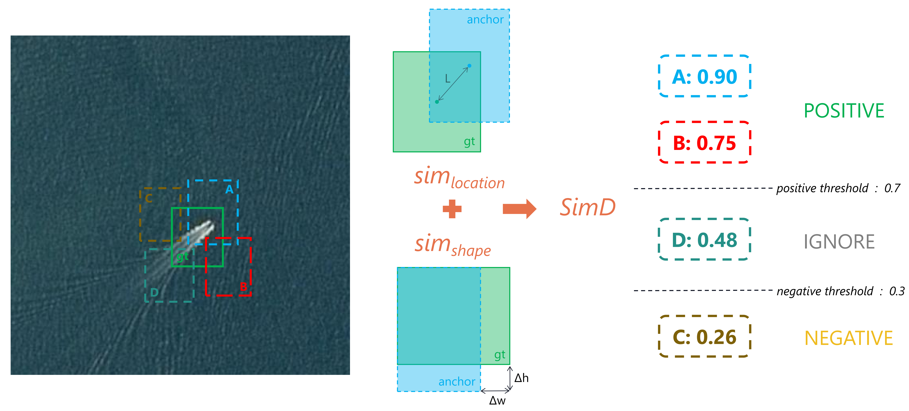

# SimD
This is the official implementation of the paper "Similarity Distance-Based Label Assignment for Tiny Object Detection".
## Introduction
SimD is a novel bounding box similarity evaluation metric for label assignment that can replace traditional IoU-based label assignment strategies and boost their performance on tiny object detection tasks.

**Abstract**: Tiny object detection is becoming one of the most challenging tasks in computer vision because of the limited object size and lack of information. The label assignment strategy is a key factor affecting the accuracy of object detection. Although there are some effective label assignment strategies for tiny objects, most of them focus on reducing the sensitivity to the bounding boxes to increase the number of positive samples and have some fixed hyperparameters need to set. However, more positive samples may not necessarily lead to better detection results, in fact, excessive positive samples may lead to more false positives. In this paper, we introduce a simple but effective strategy named the Similarity Distance (SimD) to evaluate the similarity between bounding boxes. This proposed strategy not only considers both location and shape similarity but also learns hyperparameters adaptively, ensuring that it can adapt to different datasets and various object sizes in a dataset. Our approach can be simply applied in common anchor-based detectors in place of the IoU for label assignment and Non Maximum Suppression (NMS). Extensive experiments on four mainstream tiny object detection datasets demonstrate superior performance of our method, especially, 1.8 AP points and 4.1 AP points of very tiny higher than the state-of-the-art competitors on AI-TOD.

## Installation
Required environments:

-   Linux
-   Python 3.6+
-   PyTorch 1.3+
-   CUDA 9.2+
-   GCC 5+
-   [MMCV](https://mmcv.readthedocs.io/en/latest/#installation)
-   [cocoapi-aitod](https://github.com/jwwangchn/cocoapi-aitod)

Install:

Note that this repository is based on the [MMDetection](https://github.com/open-mmlab/mmdetection). Assume that your environment has satisfied the above requirements, please follow the following steps for installation.

    git clone https://github.com/cszzshi/SimD.git
    cd SimD
    pip install -v -e .

Verify the installation:

To verify whether MMDetection is installed correctly, we provide some sample codes to run an inference demo.

**Step 1.** We need to download config and checkpoint files.

    mim download mmdet --config rtmdet_tiny_8xb32-300e_coco --dest .
  
  **Step 2.** Verify the inference demo.
  
    python demo/image_demo.py demo/demo.jpg rtmdet_tiny_8xb32-300e_coco.py --weights rtmdet_tiny_8xb32-300e_coco_20220902_112414-78e30dcc.pth --device cpu

You will see a new image `demo.jpg` on your `./outputs/vis` folder, where bounding boxes are plotted on cars, benches, etc.

## Get Started

Prepare the dataset:

VisDrone2019 dataset
 - trainset (1.44 GB): [Baidu Yun](https://pan.baidu.com/s/1K-JtLnlHw98UuBDrYJvw3A) | [Google Drive](https://drive.google.com/file/d/1a2oHjcEcwXP8oUF95qiwrqzACb2YlUhn/view?usp=sharing)
 - valset (0.07 GB): [Baidu Yun](https://pan.baidu.com/s/1jdK_dAxRJeF2Xi50IoML1g) | [Google Drive](https://drive.google.com/file/d/1bxK5zgLn0_L8x276eKkuYA_FzwCIjb59/view?usp=sharing)

Train and test:

**Step 1.** Train the model using single GPU.

    python tools/train.py configs/simd/visdrone/faster-rcnn_r50_fpn_1x_sim_visdrone.py

**Step 2.** Test the trained weight using single GPU.

    python tools/test.py configs/simd/visdrone/faster-rcnn_r50_fpn_1x_sim_visdrone.py work_dirs/visdrone/faster-rcnn_r50_fpn_1x_sim_visdrone/epoch_12.pth
    
Links of other datasets:

- AI-TOD (22.95 GB):  [Extreme Mart](https://www.cvmart.net/dataSets/detail/361)
- AI-TODv2 (22.95 GB): [Google Drive](https://drive.google.com/drive/folders/1Er14atDO1cBraBD4DSFODZV1x7NHO_PY?usp=sharing)
- SODA-D (24.95GB): [Google Drive](https://nwpueducn-my.sharepoint.com/:f:/g/personal/gcheng_nwpu_edu_cn/EhXUvvPZLRRLnmo0QRmd4YUBvDLGMixS11_Sr6trwJtTrQ?e=PellK6)

